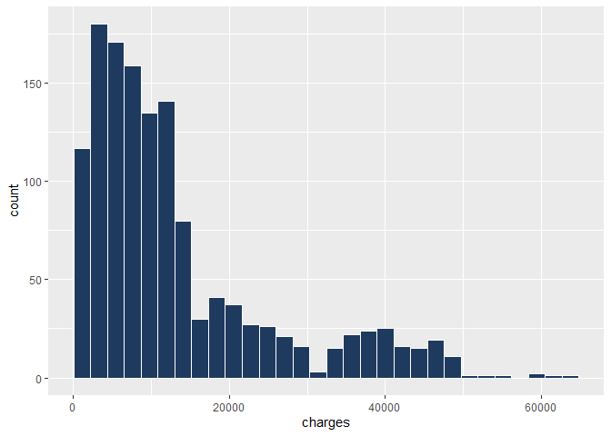
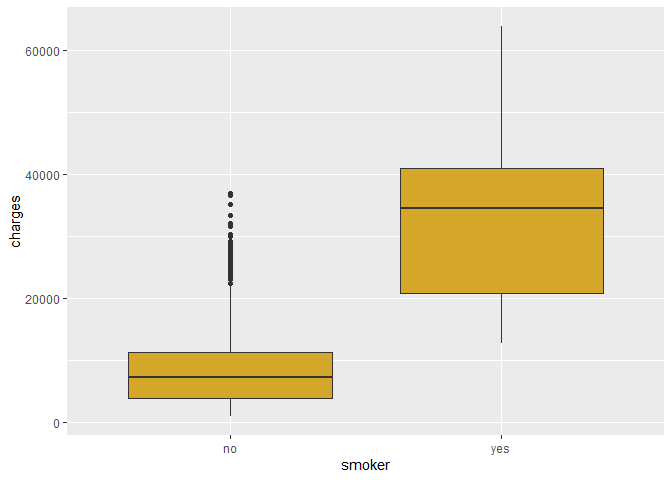
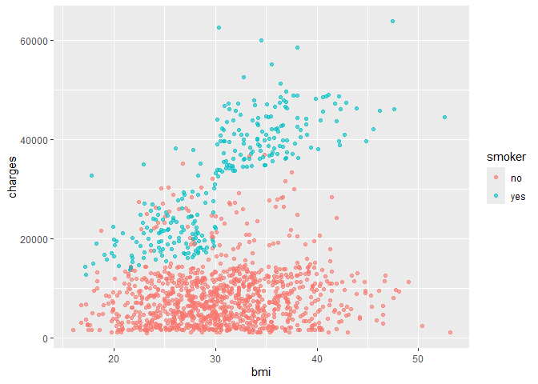
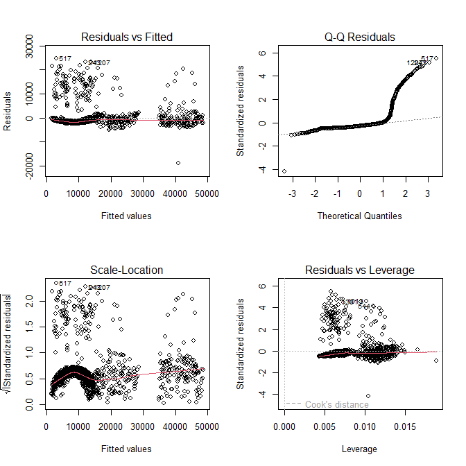

Biaya Asuransi Kesehatan: Perokok dan Obesitas
================

Analisis regresi untuk melihat faktor apa yang paling memengaruhi biaya
asuransi kesehatan, dan model mana yang paling akurat memprediksinya.
Data: [Medical Cost Personal
Datasets](https://www.kaggle.com/datasets/mirichoi0218/insurance) dari
Kaggle (1.338 baris).

## Data

``` r
library(ggplot2)

df <- read.csv("insurance.csv")
df$sex <- as.factor(df$sex)
df$smoker <- as.factor(df$smoker)
df$region <- as.factor(df$region)

str(df)
```

    ## 'data.frame':    1338 obs. of  7 variables:
    ##  $ age     : int  19 18 28 33 32 31 46 37 37 60 ...
    ##  $ sex     : Factor w/ 2 levels "female","male": 1 2 2 2 2 1 1 1 2 1 ...
    ##  $ bmi     : num  27.9 33.8 33 22.7 28.9 ...
    ##  $ children: int  0 1 3 0 0 0 1 3 2 0 ...
    ##  $ smoker  : Factor w/ 2 levels "no","yes": 2 1 1 1 1 1 1 1 1 1 ...
    ##  $ region  : Factor w/ 4 levels "northeast","northwest",..: 4 3 3 2 2 3 3 2 1 2 ...
    ##  $ charges : num  16885 1726 4449 21984 3867 ...

``` r
colSums(is.na(df))
```

    ##      age      sex      bmi children   smoker   region  charges 
    ##        0        0        0        0        0        0        0

Tidak ada nilai kosong. Kolom `sex`, `smoker`, dan `region` kuubah jadi
kategori.

## Eksplorasi

``` r
ggplot(df, aes(x = charges)) +
  geom_histogram(bins = 30, fill = "#1F3A5F", color = "white")
```

<!-- -->

``` r
ggplot(df, aes(x = smoker, y = charges)) +
  geom_boxplot(fill = "#D4A62A")
```

<!-- -->

``` r
ggplot(df, aes(x = bmi, y = charges, color = smoker)) +
  geom_point(alpha = 0.6)
```

<!-- -->

Biaya miring ke kanan (rata-rata 13.270, median 9.382). Perokok biayanya
jauh lebih tinggi. Di grafik BMI, titik bukan perokok hampir datar,
sedangkan perokok melonjak di sekitar BMI 30 ke atas. Artinya efek BMI
tergantung status merokok.

## Membandingkan model

Dugaan awalku distribusi yang miring butuh model Gamma. Supaya adil, aku
uji dengan membagi data 80:20 secara acak sebanyak 30 kali, lalu
rata-ratakan RMSE di data uji.

``` r
df$obese <- as.factor(ifelse(df$bmi >= 30, "yes", "no"))
rmse <- function(a, p) sqrt(mean((a - p)^2))

set.seed(1)
ulang <- replicate(30, {
  i <- sample(nrow(df), 0.8 * nrow(df))
  tr <- df[i, ]
  te <- df[-i, ]
  a <- lm(charges ~ age + sex + bmi + children + smoker + region, data = tr)
  b <- lm(charges ~ age + sex + children + region + smoker * bmi, data = tr)
  g <- glm(charges ~ age + sex + bmi + children + smoker + region,
           family = Gamma(link = "log"), data = tr)
  d <- lm(charges ~ age + sex + children + region + smoker * obese, data = tr)
  c(linear = rmse(te$charges, predict(a, te)),
    linear_smoker_bmi = rmse(te$charges, predict(b, te)),
    gamma = rmse(te$charges, predict(g, te, type = "response")),
    linear_smoker_obese = rmse(te$charges, predict(d, te)))
})
round(rowMeans(ulang))
```

    ##              linear   linear_smoker_bmi               gamma linear_smoker_obese 
    ##                6172                4964                7964                4601

Hasilnya di luar dugaanku. Model Gamma justru tidak lebih baik dari
regresi linear biasa (7.964 vs 6.172). Yang paling berpengaruh ke
akurasi ternyata interaksi `smoker * bmi` (4.964). Setelah itu BMI
kuganti dengan penanda obesitas (BMI 30 ke atas, batas yang umum
dipakai), errornya turun lagi ke 4.601.

## Model akhir

``` r
m_final <- lm(charges ~ age + sex + children + region + smoker * obese, data = df)
summary(m_final)
```

    ## 
    ## Call:
    ## lm(formula = charges ~ age + sex + children + region + smoker * 
    ##     obese, data = df)
    ## 
    ## Residuals:
    ##      Min       1Q   Median       3Q      Max 
    ## -18829.3  -1872.4  -1306.7   -582.2  24710.6 
    ## 
    ## Coefficients:
    ##                     Estimate Std. Error t value Pr(>|t|)    
    ## (Intercept)        -1954.749    468.687  -4.171 3.23e-05 ***
    ## age                  265.486      8.812  30.126  < 2e-16 ***
    ## sexmale             -479.924    247.474  -1.939  0.05268 .  
    ## children             524.041    102.338   5.121 3.49e-07 ***
    ## regionnorthwest     -278.942    353.726  -0.789  0.43050    
    ## regionsoutheast     -587.138    348.845  -1.683  0.09259 .  
    ## regionsouthwest    -1160.701    354.505  -3.274  0.00109 ** 
    ## smokeryes          13360.059    445.408  29.995  < 2e-16 ***
    ## obeseyes             201.748    281.354   0.717  0.47346    
    ## smokeryes:obeseyes 19856.483    612.121  32.439  < 2e-16 ***
    ## ---
    ## Signif. codes:  0 '***' 0.001 '**' 0.01 '*' 0.05 '.' 0.1 ' ' 1
    ## 
    ## Residual standard error: 4502 on 1328 degrees of freedom
    ## Multiple R-squared:  0.8627, Adjusted R-squared:  0.8618 
    ## F-statistic: 927.4 on 9 and 1328 DF,  p-value: < 2.2e-16

R-squared 0,863. Usia (sekitar +265 per tahun) dan jumlah anak (sekitar
+524 per anak) signifikan. Efek yang paling menarik ada di merokok dan
obesitas:

``` r
aggregate(charges ~ smoker + obese, data = df, FUN = mean)
```

    ##   smoker obese   charges
    ## 1     no    no  7977.030
    ## 2    yes    no 21363.217
    ## 3     no   yes  8842.692
    ## 4    yes   yes 41557.990

``` r
table(df$smoker, df$obese)
```

    ##      
    ##        no yes
    ##   no  502 562
    ##   yes 129 145

Untuk bukan perokok, obesitas hampir tidak mengubah biaya (7.977 vs
8.843). Untuk perokok, biayanya hampir dua kali lipat (21.363 vs
41.558). Jadi yang mahal adalah kombinasi merokok dan obesitas, bukan
masing-masing. Ukuran kelompoknya: 502 bukan perokok tanpa obesitas, 562
bukan perokok obesitas, 129 perokok tanpa obesitas, dan 145 perokok
obesitas.

## Cek residual

``` r
par(mfrow = c(2, 2))
plot(m_final)
```

<!-- -->

Model ini kupilih karena paling akurat di data uji, bukan karena semua
asumsi regresi linear terpenuhi. Jadi p-value di atas lebih baik dibaca
sebagai petunjuk, bukan bukti pasti.

## Catatan

- Batas obesitas 30 kupilih setelah melihat grafik dari seluruh data,
  jadi perbaikan errornya sedikit lebih optimis dari kenyataan.
- Ini data observasi dari dataset contoh di Kaggle (data Amerika
  Serikat), jadi hasilnya menunjukkan hubungan, bukan sebab-akibat, dan
  belum tentu berlaku di tempat lain.
- Aku membandingkan RMSE saja untuk memilih model. MAE juga kuhitung di
  percobaan awal, dan hasilnya tidak selalu searah (model Gamma punya
  MAE bagus tapi RMSE buruk), alasan pastinya belum kuselidiki.
